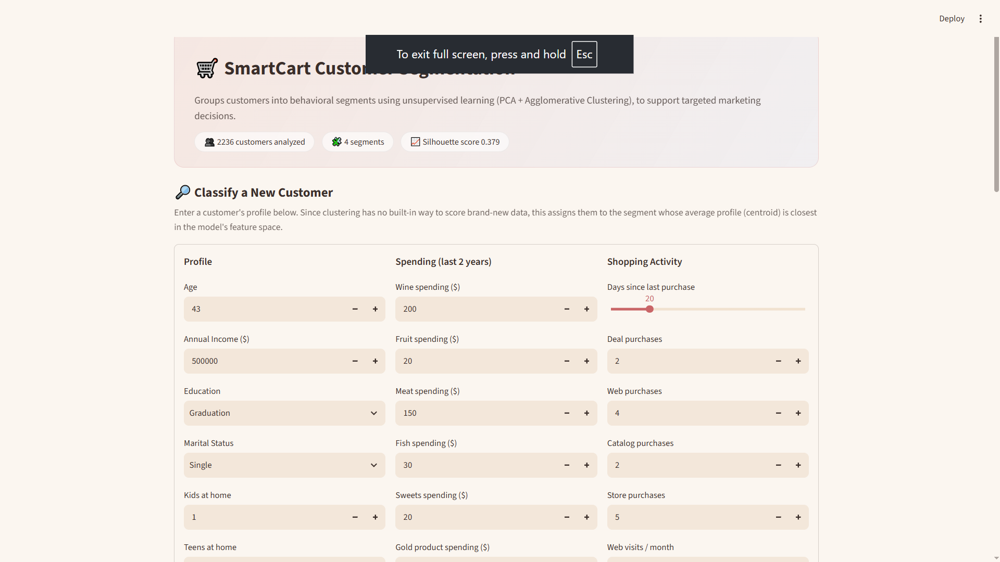
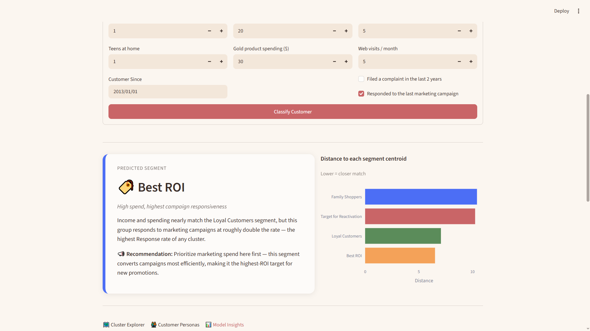
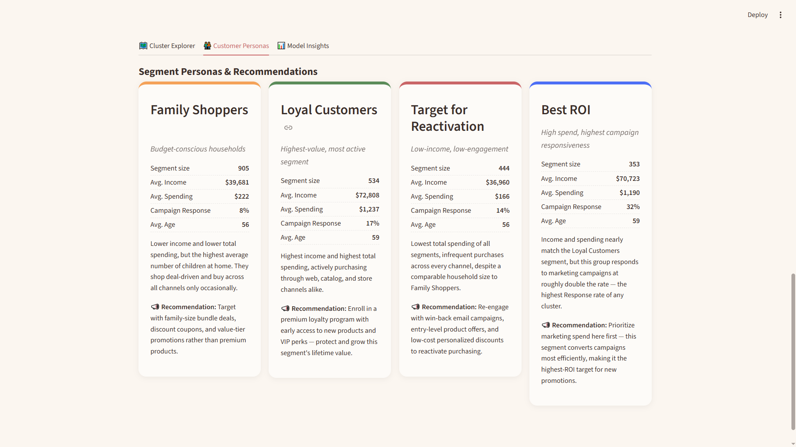

# *Ecommerce Customer Segmentation System*

A Machine Learning project that segments e-commerce customers into meaningful groups based on their purchasing behavior, income, demographics, and shopping patterns. The project leverages unsupervised learning techniques to identify high-value customers, optimize marketing campaigns, improve customer retention, and maximize business ROI through  customer segmentation.

---

## Tech Stack


---

## Project Overview

The objective of this project is to analyze customer purchasing behavior and segment customers into distinct groups using unsupervised machine learning algorithms. These customer segments can help businesses create personalized marketing strategies, improve customer retention, and maximize revenue.

---

##  Live Demo

###  Streamlit Deployment
 **Live Application:** https://ecom-segmentation-engine.streamlit.app/
 
---
## Features

- Data Cleaning & Preprocessing
- Exploratory Data Analysis (EDA)
- Feature Engineering
- One-Hot Encoding
- Feature Scaling & Standardization
- Principal Component Analysis (PCA)
- K-Means Clustering
- Hierarchical Clustering
- DBSCAN Clustering
- Cluster Evaluation
- Cluster Profiling
- Customer Segmentation
- Insights & Interpretation

---

# *Overall Result* - 
## Cluster Interpretation

### Cluster 0 (Family Shoppers)
This cluster represents low-income, low-spending customers. They make fewer purchases across all channels and generate the lowest overall value, making them budget-conscious or occasional buyers.

### Cluster 1 (Loyal Customers)
This is the best-performing cluster. Customers have the highest average income (≈72,808) and the highest total spending (≈1,237). They actively purchase through web, catalog, and physical stores, making them the most valuable and loyal customer segment.

### Cluster 2 (Target for Sales)
This cluster also consists of low-income customers, but with the lowest average spending (≈166). They make relatively few purchases and represent inactive or infrequent buyers who may require targeted promotions.

### Cluster 3 (Best ROI)
This cluster is the second-best performing segment. Customers have high income (≈70,723) and high total spending (≈1,190), with strong purchasing activity across all sales channels. They are valuable customers, although their spending is slightly lower than Cluster 1.

---

# Overall Conclusion

Cluster 1 is the most valuable customer segment because it has the highest income, highest spending, and the greatest purchasing activity across multiple channels. Cluster 3 also represents high-value customers but performs slightly below Cluster 1. In contrast, Clusters 0 and 2 consist of lower-value customers with lower income and spending, making them suitable targets for engagement and marketing campaigns.

---
## Screenshots

<p align="center">
  
</p>

<p align="center">
  
</p>

<p align="center">
  
</p>

---

## Repository Structure

```text
.
├── .streamlit/
│                           
├── app.py                                     
├── train_model.py                                  
├── model_utils.py                                  
├── requirements.txt                                
├── runtime.txt                                      
├── Ecommerce_customer_segmentation_system.ipynb  (Notebook)
├── smartcart_customers.csv (Dataset)
├── models/                                        
├── assets/                                        
├── README.md (Project docs)
│── LICENSE
└── .gitignore
```
---

---

## How to Run Locally

### 1. Clone the Repository

```bash
git clone https://github.com/banshitarout16/E.com-segmentation-sys.git
cd E.com-segmentation-sys
```

### 3. Install Dependencies

```bash
pip install -r requirements.txt
```

### 4. Train the Model 

```bash
python train_model.py
```

### 5. Run the Streamlit Application

```bash
streamlit run app.py
```

The application will open in your browser at:

```
http://localhost:8501
```
---

## License

This project is licensed under the **MIT License**. Feel free to use, modify, and distribute this project with proper attribution.